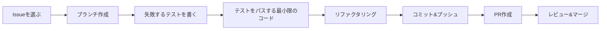

# RPi4 Interface Drivers 開発ルールブック

## 📋 目次
1. [開発の基本原則](#1-開発の基本原則)
2. [開発フロー](#2-開発フロー)
3. [Git/GitHub運用ルール](#3-gitgithub運用ルール)
4. [テスト駆動開発ルール](#4-テスト駆動開発ルール)
5. [コーディング規約](#5-コーディング規約)
6. [日常の開発作業](#6-日常の開発作業)
7. [トラブルシューティング](#7-トラブルシューティング)

---

## 1. 開発の基本原則

### 🎯 3つの鉄則
1. **テストファースト**: コードを書く前にテストを書く
2. **小さなコミット**: 1つの変更は1つのコミット
3. **毎日のプッシュ**: 作業内容は毎日GitHubにプッシュ

### 🏗️ アーキテクチャ原則
- **権限分離**: privilegedコンテナはセキュリティに必要な最小限の実装
- **単一責任**: 各コンテナは1つの役割のみ
- **疎結合**: コンテナ間はRedisイベントで通信

---

## 2. 開発フロー

### 🔄 標準的な開発サイクル


### 🤖 Claude AI活用のタイミング
- **エピック分解時**: 大きな機能開発の計画段階
- **設計レビュー時**: アーキテクチャの妥当性確認
- **複雑な問題解決時**: 技術的な課題の相談

**使用例**:
```bash
# Issueでエピック分解を依頼
@claude このエピックをサブイシューに分解してください

# PRでレビューを依頼
@claude このPRのアーキテクチャをレビューしてください
```

### 📝 具体的な手順
```bash
# 1. 最新のmainを取得
git checkout main
git pull origin main

# 2. Issueを選んでブランチ作成
git checkout -b feature/issue-42-add-i2c-scan

# 3. テストを書く（TDD）
vim tests/test_i2c_scanner.py

# 4. 実装する
vim src/i2c_scanner.py

# 5. テスト実行
pytest tests/test_i2c_scanner.py -v

# 6. コミット
git add .
git commit -m "feat(detector): add I2C device scanning

- Implement I2C bus scanning
- Add device address detection
- Handle scan errors gracefully

Closes #42"

# 7. プッシュしてPR作成
git push origin feature/issue-42-add-i2c-scan
```

---

## 3. Git/GitHub運用ルール

### 🌿 ブランチ命名規則
```
feature/issue-{番号}-{簡潔な説明}  # 新機能
fix/issue-{番号}-{簡潔な説明}      # バグ修正
test/issue-{番号}-{簡潔な説明}     # テスト追加
docs/issue-{番号}-{簡潔な説明}     # ドキュメント
refactor/{簡潔な説明}              # リファクタリング
```

**例:**
- `feature/issue-23-gpio-monitoring`
- `fix/issue-45-usb-detection-delay`
- `test/issue-67-integration-tests`

### 💬 コミットメッセージ規約（Conventional Commits）

#### フォーマット
```
<type>(<scope>): <subject>

<body>

<footer>
```

#### type一覧
| type | 用途 | 例 |
|------|------|-----|
| feat | 新機能 | `feat(detector): add GPIO monitoring` |
| fix | バグ修正 | `fix(manager): correct VID/PID parsing` |
| test | テスト | `test(processor): add MQTT tests` |
| docs | ドキュメント | `docs(readme): update setup instructions` |
| refactor | リファクタリング | `refactor(common): extract utility functions` |
| chore | その他 | `chore(deps): update pytest to 7.0` |

#### 良い例 ✅
```
feat(detector): implement udev event monitoring

- Add pyudev integration for device detection
- Implement event filtering for USB/TTY devices
- Add Redis event publishing
- Handle device removal events

The detector now publishes events to 'device_events' channel
with action (add/remove) and device path.

Closes #15
```

#### 悪い例 ❌
```
fixed stuff      # 何を修正したか不明
WIP             # 意味のないコミット
many changes    # 複数の変更を1つにまとめている
```

### 🔀 プルリクエスト（PR）ルール

#### PRテンプレート
```markdown
## 概要
<!-- このPRで何を実装/修正したか -->

## 関連Issue
Closes #42

## 変更内容
- [ ] I2Cスキャン機能を実装
- [ ] エラーハンドリングを追加
- [ ] ユニットテストを作成（カバレッジ90%）
- [ ] 統合テストを追加

## テスト結果
```
pytest tests/test_i2c_scanner.py -v
===================== test session starts =====================
tests/test_i2c_scanner.py::test_scan_empty_bus PASSED
tests/test_i2c_scanner.py::test_scan_with_devices PASSED
tests/test_i2c_scanner.py::test_scan_error_handling PASSED
===================== 3 passed in 0.42s =====================
```

## スクリーンショット
<!-- 必要に応じてUIやログの画像 -->

## チェックリスト
- [ ] テストがすべてパス
- [ ] カバレッジ80%以上
- [ ] ドキュメント更新済み
- [ ] セルフレビュー実施済み
- [ ] CIがグリーン
```

#### PRレビューのポイント
- **小さく保つ**: 300行以下が理想
- **1つの目的**: 1つのPRは1つの機能/修正
- **テスト必須**: テストのないPRは原則マージしない

---

## 4. テスト駆動開発ルール

### 🧪 TDDの3ステップ
1. **RED** 🔴: 失敗するテストを書く
2. **GREEN** 🟢: テストをパスする最小限のコード
3. **REFACTOR** 🔵: コードを改善（テストは常にパス）

### 📊 テストの種類と割合
```
         /\
        /  \  E2E テスト (10%)
       /────\  python test_e2e_flow.py
      /      \  
     /────────\ 統合テスト (30%)
    /          \ python test_integration.py
   /────────────\
  /              \ ユニットテスト (60%)
 /────────────────\ pytest tests/
```

### 🎯 テストの書き方

#### ユニットテスト例
```python
# tests/test_device_detector.py
import pytest
from unittest.mock import Mock, patch
from device_detector import DeviceDetector

class TestDeviceDetector:
    """Device Detectorのテストクラス"""
    
    def test_parse_device_event(self):
        """デバイスイベントのパースをテスト"""
        # Given (準備)
        mock_device = Mock()
        mock_device.action = 'add'
        mock_device.device_node = '/dev/ttyUSB0'
        
        # When (実行)
        detector = DeviceDetector()
        event = detector.parse_event(mock_device)
        
        # Then (検証)
        assert event['action'] == 'add'
        assert event['path'] == '/dev/ttyUSB0'
        assert 'timestamp' in event
    
    @pytest.mark.parametrize("action,expected", [
        ('add', True),
        ('remove', True),
        ('change', False),
        ('bind', False),
    ])
    def test_should_process_event(self, action, expected):
        """処理すべきイベントの判定をテスト"""
        detector = DeviceDetector()
        assert detector.should_process(action) == expected
```

#### 統合テスト例
```python
# integration_tests/test_detection_flow.py
import pytest
import redis
import json
import time

class TestDetectionFlow:
    """デバイス検出フローの統合テスト"""
    
    @pytest.fixture
    def redis_client(self):
        """Redisクライアントのフィクスチャ"""
        client = redis.Redis(decode_responses=True)
        yield client
        client.flushall()
    
    def test_device_detection_publishes_event(self, redis_client):
        """デバイス検出時にイベントが発行されることをテスト"""
        # Given: Redisのサブスクライバを準備
        pubsub = redis_client.pubsub()
        pubsub.subscribe('device_events')
        
        # When: モックデバイスイベントを発生
        trigger_mock_device_event('add', '/dev/ttyUSB0')
        
        # Then: イベントが発行されることを確認
        message = wait_for_message(pubsub, timeout=5)
        event = json.loads(message['data'])
        assert event['action'] == 'add'
        assert event['path'] == '/dev/ttyUSB0'
```

### ⚡ テストのベストプラクティス
1. **AAA パターン**: Arrange(準備), Act(実行), Assert(検証)
2. **1テスト1アサーション**: 1つのテストは1つのことだけ検証
3. **テスト名は仕様書**: `test_should_return_error_when_device_not_found`
4. **モックは最小限**: 必要な部分だけモック化

---

## 5. コーディング規約

### 🐍 Python規約
```python
# スタイルガイド: PEP 8 準拠
# フォーマッター: black
# リンター: flake8
# 型チェック: mypy

# 良い例 ✅
class DeviceDetector:
    """デバイス検出を行うクラス"""
    
    def __init__(self, redis_host: str = 'localhost') -> None:
        self.redis_client = redis.Redis(host=redis_host)
    
    async def detect_devices(self) -> List[Device]:
        """接続されているデバイスを検出する
        
        Returns:
            List[Device]: 検出されたデバイスのリスト
        """
        devices = []
        # 実装...
        return devices
```

### 📁 ファイル構造
```
component/
├── src/
│   ├── __init__.py
│   ├── main.py          # エントリーポイント
│   └── detector.py      # メインロジック
├── tests/
│   ├── __init__.py
│   ├── conftest.py      # pytest設定
│   └── test_detector.py # テスト
├── Dockerfile
├── requirements.txt
└── README.md
```

---

## 6. 日常の開発作業

### 🌅 朝のルーティン
```bash
# 1. mainブランチを最新に
git checkout main
git pull origin main

# 2. 自分のブランチを更新
git checkout feature/my-feature
git rebase main

# 3. テストを実行
pytest

# 4. 開発開始！
```

### 🏃 開発中の作業
```bash
# テストを監視モードで実行
pytest-watch

# 別ターミナルでログ監視
docker-compose logs -f device-detector

# 定期的にコミット（1-2時間ごと）
git add -p  # 対話的に追加
git commit -m "feat(detector): add partial implementation"
```

### 🌙 終業前のチェックリスト
- [ ] すべてのテストがパス
- [ ] コードがフォーマット済み（`black .`）
- [ ] 作業内容をコミット
- [ ] GitHubにプッシュ
- [ ] 明日のタスクをIssueに記載

---

## 7. トラブルシューティング

### 🚨 よくある問題と解決法

#### テストが失敗する
```bash
# キャッシュをクリア
find . -type d -name __pycache__ -exec rm -r {} +
pytest --cache-clear

# 特定のテストだけ実行
pytest tests/test_specific.py::TestClass::test_method -v
```

#### マージコンフリクト
```bash
# mainを取り込む
git fetch origin
git rebase origin/main

# コンフリクトを解決
git status  # コンフリクトファイルを確認
# ファイルを編集して解決
git add <resolved-files>
git rebase --continue
```

#### CIが失敗
1. ローカルで同じコマンドを実行
2. `docker-compose -f docker-compose.test.yml up`
3. ログを確認
4. 環境差異をチェック

### 📞 困ったときは
1. **まずドキュメントを確認**
2. **Slackで質問**（#dev-rpi4-drivers）
3. **ペアプログラミングを依頼**
4. **定例会で相談**

---

## 📚 参考リンク
- [Conventional Commits](https://www.conventionalcommits.org/)
- [Python PEP 8](https://pep8.org/)
- [pytest Documentation](https://docs.pytest.org/)
- [プロジェクトWiki](https://github.com/org/repo/wiki)

---

**Remember**: 良いコードは良いテストから生まれる！ 🚀