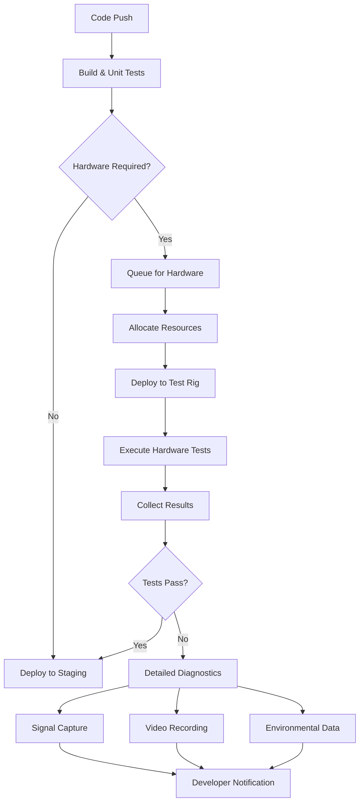

# Hardware Truth: Real Hardware Integration Testing Strategy

## Core Philosophy
> "A test that doesn't run on real hardware is just a comfortable lie."

This document outlines our approach to making hardware testing as authentic, fast, and convenient as mock testing while maintaining 100% confidence in real-world functionality.

## 1. Physical Test Rig Architecture

### 1.1 Modular Test Station Design
```
┌─────────────────────────────────────────────────────────────┐
│                     Test Station Unit                         │
├─────────────────────────────────────────────────────────────┤
│ ┌─────────────┐  ┌─────────────┐  ┌─────────────┐         │
│ │   RPi4 #1   │  │   RPi4 #2   │  │   RPi4 #3   │  ...    │
│ │  (Primary)  │  │ (Secondary) │  │  (Tertiary) │         │
│ └──────┬──────┘  └──────┬──────┘  └──────┬──────┘         │
│        │                 │                 │                 │
│ ┌──────┴─────────────────┴─────────────────┴───────────┐   │
│ │              USB Hub & Power Management               │   │
│ └───────────────────────┬───────────────────────────────┘   │
│                         │                                    │
│ ┌───────────────────────┴───────────────────────────────┐   │
│ │                  Test Fixture Board                    │   │
│ │  ┌─────┐ ┌─────┐ ┌─────┐ ┌─────┐ ┌─────┐ ┌─────┐   │   │
│ │  │GPIO │ │ I2C │ │ SPI │ │UART │ │ ADC │ │ PWM │   │   │
│ │  │Test │ │Test │ │Test │ │Test │ │Test │ │Test │   │   │
│ │  └─────┘ └─────┘ └─────┘ └─────┘ └─────┘ └─────┘   │   │
│ └───────────────────────┬───────────────────────────────┘   │
│                         │                                    │
│ ┌───────────────────────┴───────────────────────────────┐   │
│ │              Automated Test Equipment (ATE)            │   │
│ │  - Signal Generators    - Logic Analyzers             │   │
│ │  - Oscilloscopes        - Protocol Analyzers          │   │
│ └───────────────────────────────────────────────────────┘   │
└─────────────────────────────────────────────────────────────┘
```

### 1.2 Test Fixture Components

#### GPIO Test Module
- **LED Arrays**: Visual feedback and output verification
- **Button Matrix**: Input simulation with debounce testing
- **Relay Banks**: Load switching and isolation testing
- **Pull-up/Pull-down Networks**: Edge case testing

#### I2C Test Module
- **Multi-Address EEPROM Array**: Read/write verification
- **I2C Multiplexer**: Bus switching and conflict testing
- **Clock Stretching Simulator**: Timing edge cases
- **Bus Fault Injector**: Error handling validation

#### SPI Test Module
- **High-Speed Flash Memory**: Performance testing
- **Multi-Slave Configuration**: CS management testing
- **Loopback Connectors**: Data integrity verification
- **Variable Clock Generator**: Speed limit testing

#### UART Test Module
- **Loopback with Configurable Delays**: Timing tests
- **Baud Rate Generator**: Speed verification
- **Parity/Frame Error Injector**: Error handling
- **RS232/RS485 Converters**: Protocol testing

### 1.3 Environmental Testing Chamber
```yaml
environmental_chamber:
  temperature:
    range: -20°C to 85°C
    ramp_rate: 5°C/minute
    stability: ±0.5°C
  
  humidity:
    range: 10% to 95% RH
    control: ±2% RH
  
  vibration:
    frequency: 10Hz to 2kHz
    acceleration: up to 5g
  
  power_cycling:
    voltage_range: 4.5V to 5.5V
    brownout_simulation: true
    spike_injection: up to 6V/100ms
```

## 2. Hardware Pool Management System

### 2.1 Pool Architecture
```python
class HardwarePool:
    """Manages a pool of test hardware resources"""
    
    def __init__(self):
        self.devices = {
            'rpi4': [
                RPi4Device(id='rpi4-001', capabilities=['gpio', 'i2c', 'spi', 'uart']),
                RPi4Device(id='rpi4-002', capabilities=['gpio', 'i2c', 'spi', 'uart']),
                RPi4Device(id='rpi4-003', capabilities=['gpio', 'i2c', 'specialized']),
                # ... up to N devices
            ],
            'fixtures': {
                'gpio': [GPIOFixture(id='gpio-001'), GPIOFixture(id='gpio-002')],
                'i2c': [I2CFixture(id='i2c-001', devices=16)],
                'spi': [SPIFixture(id='spi-001', max_speed='50MHz')],
                'uart': [UARTFixture(id='uart-001', channels=4)],
            }
        }
        
    def allocate(self, requirements: TestRequirements) -> TestHarness:
        """Allocate hardware based on test requirements"""
        # Intelligent allocation based on:
        # - Required interfaces
        # - Performance requirements
        # - Environmental needs
        # - Current availability
```

### 2.2 Scheduling Strategy
```yaml
scheduling:
  priorities:
    - level: CRITICAL
      description: Security and safety tests
      max_wait: 5 minutes
      preemptible: false
    
    - level: HIGH
      description: Release blocking tests
      max_wait: 15 minutes
      preemptible: true
    
    - level: NORMAL
      description: Feature tests
      max_wait: 1 hour
      preemptible: true
    
    - level: LOW
      description: Long-running stress tests
      max_wait: 24 hours
      preemptible: true
  
  allocation_strategy:
    algorithm: "weighted_fair_queue"
    factors:
      - test_duration_estimate
      - hardware_requirements
      - team_quota_usage
      - time_since_last_run
  
  optimization:
    batch_similar_tests: true
    minimize_reconfiguration: true
    parallel_execution: true
    predictive_scheduling: true
```

### 2.3 Remote Access Interface
```python
class RemoteHardwareInterface:
    """Provides remote access to hardware test rigs"""
    
    async def connect(self, device_id: str) -> HardwareSession:
        """Establish secure connection to remote hardware"""
        session = await self._establish_vpn_tunnel(device_id)
        await self._verify_hardware_state(session)
        return session
    
    async def execute_test(self, session: HardwareSession, test: HardwareTest):
        """Execute test on remote hardware with real-time feedback"""
        # Stream logs and metrics in real-time
        # Provide interactive debugging capability
        # Record all signals for playback
```

## 3. Hardware-in-the-Loop (HIL) Continuous Testing

### 3.1 Test Execution Pipeline


### 3.2 Test Categories

#### Smoke Tests (< 30 seconds)
- Basic connectivity verification
- Interface presence detection
- Power-on self-test
- Quick loopback tests

#### Functional Tests (< 5 minutes)
- Protocol compliance verification
- Data integrity tests
- Timing accuracy validation
- Error handling verification

#### Stress Tests (< 30 minutes)
- Maximum throughput testing
- Concurrent interface usage
- Temperature cycling
- Power fluctuation resilience

#### Endurance Tests (hours to days)
- Long-term stability
- Memory leak detection
- Thermal management
- Component aging simulation

### 3.3 Performance Metrics Dashboard
```yaml
dashboard:
  real_time_metrics:
    - test_queue_depth
    - hardware_utilization
    - test_execution_time
    - failure_rate_by_category
    
  historical_analytics:
    - mtbf_by_component
    - regression_detection
    - performance_trends
    - environmental_correlations
  
  alerts:
    - hardware_offline
    - abnormal_failure_rate
    - queue_backup
    - resource_starvation
```

## 4. Making Hardware Testing Convenient

### 4.1 Local Development Experience
```bash
# Developer runs same tests locally as in CI
$ rpi-test run --suite=gpio

🔍 Checking for local hardware...
❌ No local RPi4 detected
📡 Connecting to hardware pool...
✅ Allocated rpi4-042 (queue time: 12s)
🏃 Running tests...
  ✓ GPIO.test_output_high [0.2s]
  ✓ GPIO.test_input_pullup [0.3s]
  ✓ GPIO.test_interrupt_edge [0.5s]
📊 Results: 3/3 passed in 1.0s
🎬 Video replay: https://hw-pool/session/abc123
📈 Signal traces: https://hw-pool/traces/abc123
```

### 4.2 Hybrid Testing Mode
```python
@pytest.mark.hardware
class TestI2CProtocol:
    """Tests that seamlessly work with mocks or real hardware"""
    
    def test_device_discovery(self, i2c_bus):
        # This fixture provides either:
        # - Mock I2C bus (fast, for development)
        # - Remote hardware I2C (for validation)
        # - Local hardware I2C (if available)
        
        devices = i2c_bus.scan()
        assert len(devices) > 0
        
    @pytest.mark.timing_critical
    def test_clock_stretching(self, i2c_bus, oscilloscope):
        # Automatically allocates oscilloscope when on real hardware
        # Provides simulated waveforms when on mocks
        i2c_bus.configure(clock_stretch_timeout=100)
        waveform = oscilloscope.capture(channel='SCL')
        assert waveform.measure_frequency() == 400_000  # 400kHz
```

### 4.3 Test Result Artifacts
```yaml
test_artifacts:
  always_collected:
    - logs/test_output.txt
    - metrics/performance.json
    - coverage/hardware_coverage.xml
  
  on_failure:
    - debug/core_dumps
    - traces/logic_analyzer_capture.vcd
    - video/test_execution.mp4
    - thermal/temperature_profile.csv
    - power/current_consumption.csv
  
  interactive_debugging:
    - remote_shell_access
    - jtag_debug_session
    - live_oscilloscope_view
    - gpio_pin_control_panel
```

### 4.4 Hardware Mock Parity
```python
class HardwareMockValidator:
    """Ensures mocks accurately represent hardware behavior"""
    
    def validate_mock_behavior(self, mock_class, hardware_class):
        # Run identical test suite against both
        mock_results = run_tests(mock_class)
        hardware_results = run_tests(hardware_class)
        
        # Compare:
        # - Timing characteristics
        # - Error conditions
        # - Edge case handling
        # - Performance metrics
        
        discrepancies = compare_results(mock_results, hardware_results)
        if discrepancies:
            generate_mock_updates(discrepancies)
```

## 5. Implementation Roadmap

### Phase 1: Foundation (Weeks 1-4)
- [ ] Design and build first test rig prototype
- [ ] Implement basic hardware pool manager
- [ ] Create remote access infrastructure
- [ ] Develop core test execution engine

### Phase 2: Integration (Weeks 5-8)
- [ ] Integrate with existing CI/CD pipeline
- [ ] Implement test result collection and analysis
- [ ] Create developer-friendly CLI tools
- [ ] Build real-time monitoring dashboard

### Phase 3: Scale (Weeks 9-12)
- [ ] Deploy multiple test stations
- [ ] Implement advanced scheduling algorithms
- [ ] Add environmental testing capabilities
- [ ] Create hardware mock validation system

### Phase 4: Optimization (Weeks 13-16)
- [ ] Machine learning for predictive scheduling
- [ ] Automated failure root cause analysis
- [ ] Performance optimization based on metrics
- [ ] Full platform support (Jetson, BeagleBone)

## 6. Success Metrics

### Technical Metrics
- **Hardware Test Coverage**: >95% of all interface functionality
- **Test Execution Time**: <5 minutes for smoke tests, <30 minutes for full suite
- **Queue Wait Time**: <5 minutes average, <15 minutes p95
- **Hardware Utilization**: >80% during business hours

### Developer Experience Metrics
- **Local vs Remote Parity**: >99% test result consistency
- **Debug Time Reduction**: 50% faster issue resolution
- **False Positive Rate**: <0.1% due to hardware issues
- **Developer Satisfaction**: >4.5/5 in quarterly surveys

### Business Impact Metrics
- **Production Bug Reduction**: 70% fewer hardware-related issues
- **Release Confidence**: 100% hardware validation before release
- **Time to Market**: 30% faster feature delivery
- **Support Ticket Reduction**: 60% fewer hardware-related tickets

## 7. Challenges and Mitigations

### Challenge: Hardware Maintenance
**Mitigation**: Automated health checks, predictive maintenance, hot-swappable components

### Challenge: Scaling Costs
**Mitigation**: Shared infrastructure, cloud-like usage model, team quotas

### Challenge: Test Flakiness
**Mitigation**: Hardware isolation, environmental control, automatic retry with diagnostics

### Challenge: Geographic Distribution
**Mitigation**: Regional hardware pools, edge computing nodes, intelligent routing

## Conclusion

By treating hardware testing with the same rigor and automation as software testing, we can achieve the "hardware truth" philosophy while maintaining developer productivity. This strategy makes hardware testing not just possible, but preferable to mock-only testing, ensuring our software works reliably in the real world.